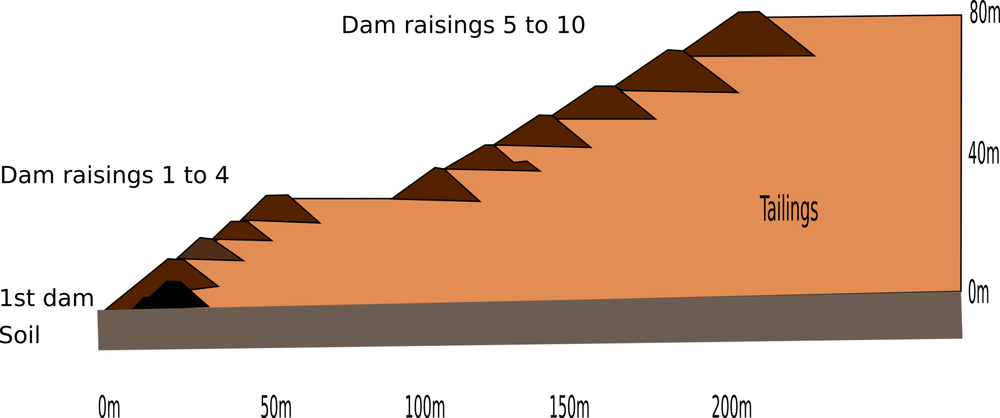
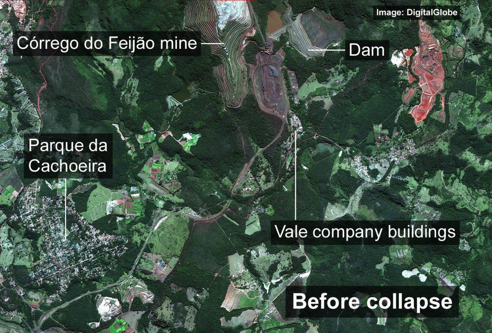
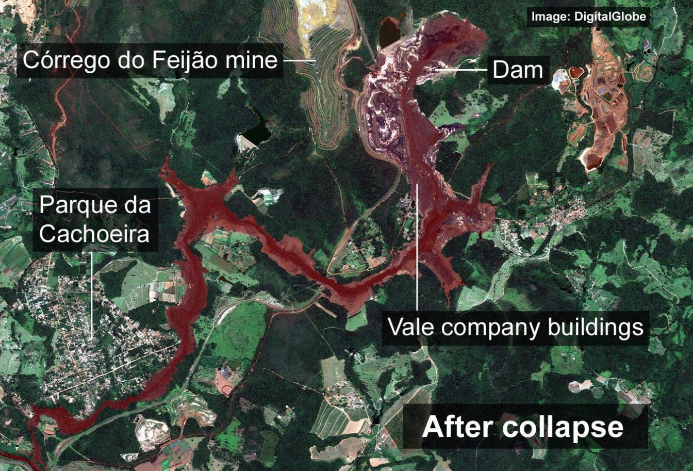
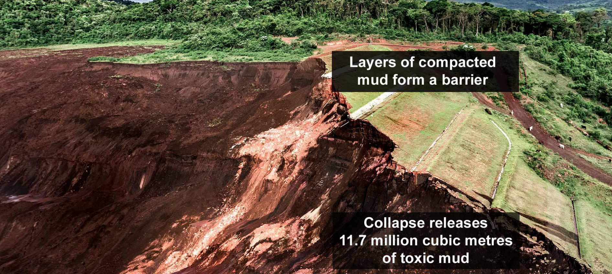
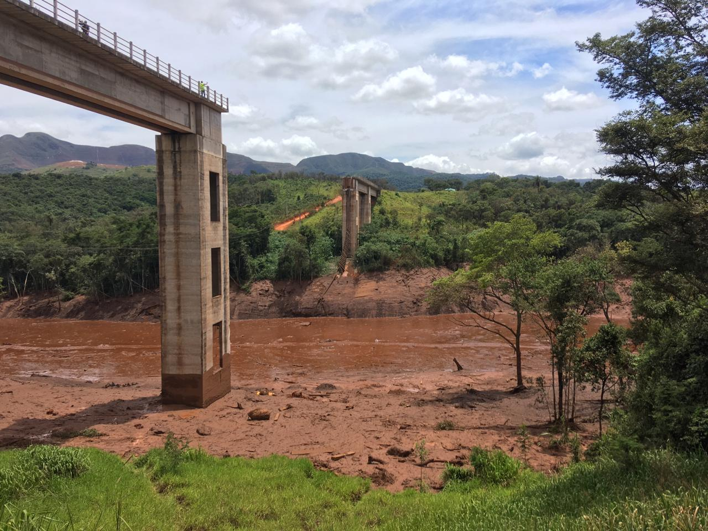
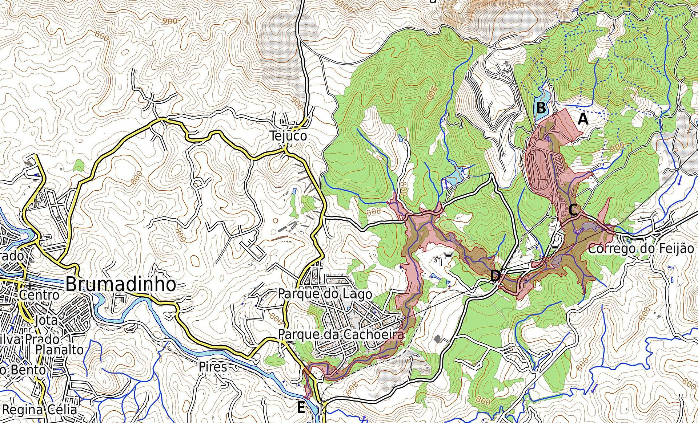
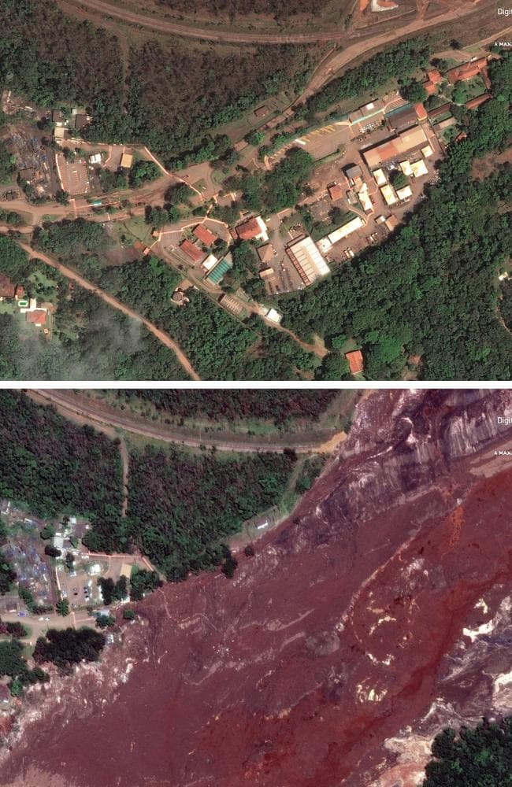

# 巴西尾矿坝溃坝事故

造成三百多人死亡或失踪的巴西淡水河谷公司(Vale)尾矿坝溃坝事故(Brumadinho dam disaster)国内似乎鲜有关注。 事故发生在当地时间1日25日12时28分,一千多万方的矿渣倾泻而下,最高时速达到了70km/h。 "我们都觉得坝里(的矿渣)是干的,从表面看像足球场一样,又硬又实,绝不是像和稀泥一样。" ([bbc专题](https://www.bbc.co.uk/news/resources/idt-sh/brazil_dam_disaster))  
实际上一个表面看起来干的土堆里面不一定干,更何况它有八十多米高。 在降雨作用下,尾矿坝里不可避免地积累了水,就好比用一个底下没开孔的花盆种花,水浇多了,底下就积水了。 但"有水"只是滑坡发生的一部分原因。  
一部分滑坡的直接原因是水导致土体强度变低。这种因素触发的滑坡往往会发生在降水过程中,或者降水结束后的一段时间(雨水继续下渗过程中)。 但本次滑坡发生时,堆土表面还是干硬的,可见并不是近期降雨直接导致的。  
下图是坝体的简图：  

有时候，即便外界环境没有显著变化， 堆土内部也会悄然发生改变。以至于昨天还能站得住（保持平衡），第二天就一泻千里了。相关的解释和理论有很多，我个人倾向于如下的解释：  
堆土在自重应力下会发生次固结，也就是有体积缩小的趋势。一块土体积缩小并不是里面的固体减少，而是固体骨架发生一定变化，导致孔隙有减少的趋势。这一过程中孔隙中的水压逐渐增加；总应力基本恒定，水压增加，土的有效应力减小，直至破坏。一旦动起来，这玩意儿就极容易液化，好端端的土变成了流动性极强的流体，收不住了。我个人认为2015年的深圳滑坡事故与之类似。  

这是事故前的卫星图：  

这是事故后的：  

事故后的（原）堆土体：  

坝下游不远处，运送矿石的通道被冲毁：  

影响范围示意图：  

红色的矿渣可能流了30km（未确认）。这是被污泥覆盖的村庄：

关于事故原因，有一点可以肯定的是，该公司本没有对尾矿坝的安全问题引起足够的重视，也没有从其他尾矿坝溃坝事故中吸取教训。虽然堆填过程中会压实，但和自然山有体比起来，尾矿仍然是松散堆积物，其固结及次固结会持续很长时间。防水、排水在保证大坝安全过程中尤为重要。  
另外监测和预警也很重要，如果没有足够的技术能力处理好，就看好它。做好位移、水压等监测。在可能出现险情的时候早做疏散。事故一旦发生，做什么都来不及了。有报道显示，去年该公司就发现了现场传感器失灵，但为采引起重视，也未取任何措施。[Brazil's Vale knew about sensor problems at dam before burst](
https://www.reuters.com/article/us-vale-sa-disaster-sensors/brazils-vale-knew-about-sensor-problems-at-dam-before-burst-globo-tv-idUSKCN1PV2MS)  

道路千万条，安全第一条啊。看了相关的报导，真的很难受。类似的事情一遍遍在全球上演，这种人祸什么时候才能终结？  
